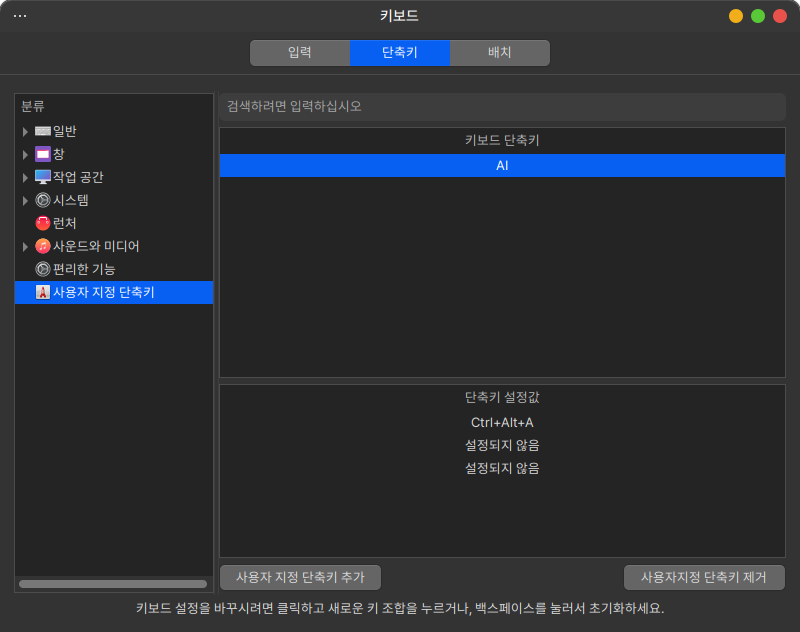
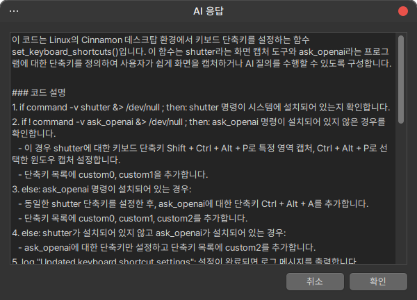

## hamonikr-system

이 패키지는 하모니카OS의 기본 환경을 구성하는 필수 패키지입니다.

## 기능

### GPT 플러그인 기능 업데이트 (2024-07-20)
새 버전에서는 시스템의 오류메시지를 챗GPT 가 응답하는 기능이 추가되었습니다.
 - GTP-4o-mini 엔진 사용

#### API 키 등록
이 기능을 사용하기 위해서는 다음과 같은 과정이 필요합니다.

먼저 설정 파일(`~/.ask_openai.conf`)을 작성:
```
[openai]
api_key = YOUR_OPEN_AI_API_KEY
```

#### 사용법

시스템 사용중 오류메세지를 만나면 해당 오류를 복사한 후 시스템 단축키 `CRTL + ALT + a` 를 누릅니다.
만약 단축키를 변경하시려면 시작메뉴 > 키보트 > 단축키 탭 메뉴 에서 사용자 지정 단축키를 원하는 키로 변경합니다.



### Screenshot




### 하모니카 시스템 서비스 비활성화:

* 위치: /etc/hamonikr/hamonikrSystem.conf
* 설정: [global] 섹션에서 enable = False

### 경량화 모드:

* 설정: /etc/hamonikr/hamonikrSystem.conf에서 minimal = True
* 제외 프로그램/프로세스 목록: /usr/share/hamonikr/hamonikr-min/killapps, /usr/share/hamonikr/hamonikr-min/killps
* 복원: minimal = False로 설정 후 시스템 재시작

## 주요 구성 요소

### 디렉토리 및 파일:
* /etc/hamonikr, /etc/hamonikr/apt, /etc/hamonikr/adjustments 등
* /usr/lib/hamonikr/hamonikr-system, /usr/local/bin 등

### 서비스: hamonikr-system.service
* APT pinning: /etc/apt/apt.conf.d/00hamonikr, /etc/apt/preferences.d/hamonikr.pref

### 배포본 정보 파일
* /etc/hamonikr/info, /etc/hamonikr/lsb-release, /etc/hamonikr/os-release, /usr/lib/os-release

### SSH 터미널 정보
* /etc/hamonikr/issue, /etc/hamonikr/issue.net

## 개발자를 위한 지침

### 시스템 전역 변경
* 방법: /etc/hamonikr/adjustments 내 파일 수정
## hamonikr-system

이 패키지는 하모니카OS의 기본 환경을 구성하는 필수 패키지입니다.

## 기능

### 하모니카 시스템 서비스 비활성화:

* 위치: `/etc/hamonikr/hamonikrSystem.conf`
* 설정: [global] 섹션에서 enable = False

### 경량화 모드:

* 설정: /etc/hamonikr/hamonikrSystem.conf에서 minimal = True
```
[global]
enable = False
```

* 제외 프로그램/프로세스 목록: /usr/share/hamonikr/hamonikr-min/killapps, /usr/share/hamonikr/hamonikr-min/killps
* 복원: minimal = False로 설정 후 시스템 재시작

## 주요 구성 요소

### 디렉토리 및 파일:
- debian : 패키지 빌드
- etc/hamonikr : 하모니카OS 정보
- etc/hamonikr/apt : apt pinning
- etc/hamonikr/adjustments : 하모니카OS 환경 설정
- etc/hamonikr/templates : 다양한 설정 기본 파일
- etc/init.d : hamonikr-system 서비스 구동 파일
- etc/skel : 계정 생성 기본 파일들
- etc/xdg/autostart : 데스크톱 시작 프로그램
- usr/lib/hamonikr/hamonikr-system : 시스템 설정 실행 프로그램 (hamonikr-adjust.py)
- usr/local/bin : 데스크톱 테마 적용 프로그램 (update-dconf-setting)
- share : 하모니카OS 구동에 필요한 리소스

### 시스템 서비스
- hamonikr-system.service

### APT pinning
- etc/apt/apt.conf.d/00hamonikr
- etc/apt/preferences.d/hamonikr.pref

### 하모니카 배포본 정보
- /etc/hamonikr/info
- /etc/hamonikr/lsb-release
- /etc/hamonikr/os-release
- /usr/lib/os-release

### ssh 터미널 접속시 보여줄 정보
- /etc/hamonikr/issue
- /etc/hamonikr/issue.net

## 개발자를 위한 지침

### 시스템 전역 변경
* 방법: /etc/hamonikr/adjustments 내 파일 수정

### 파일 유형:
.execute, .execute-once, .overwrite, .preserve, .menu

etc/hamonikr/adjustments 안에 수정을 원하는 파일을 작성하면 시스템 시작시 적용됩니다.

여기 포함된 파일들은 아래와 같은 확장자로 구분해서 각각의 동작이 실행됩니다.

 * .execute : 실행이 되는 파일이며 실행권한 필요 (매번 반복)
 * .execute-once : 1회만 실행이 되는 파일이며 실행권한 필요
 * .overwrite : 공백으로 구분된 2개의 필드로 원본과 덮어쓰기 할 대상을 입력하면 적용. 대상이 없는 경우 패스
 * .preserve : 덮어쓰기 하지 않을 파일을 한줄씩 입력하면 시스템 변경시 제외된다.
 * .menu : 데스크톱에 나오는 메뉴를 조정하는 파일로 'exec, hide, show, onlyshowin, rename, categories' 같은 지시어를 사용

    ```
    exec /usr/shar/fglrx/amdccclesu.desktop gksu /usr/bin/amdcccle;
    hide /usr/shar/applications/xfce-file-manager.desktop;
    categories /usr/shar/applications/libreoffice-draw.desktop Office;
    ```

### 프로그램 메뉴 카테고리
[Category](https://specifications.freedesktop.org/menu-spec/latest/apa.html) :
AudioVideo / Audio / Video / Development / Education / Game / Graphics / Network
/ Office / Science / Settings / System / Utility


### 개별 사용자 환경 변경
* 실행: /etc/xdg/autostart/hamonikr-user-env.desktop → /usr/local/bin/set-user-env
* 로그: $HOME/.hamonikr/log/set-user-env.log
* 복원 명령: set-user-env restore

### 디버깅

#### 각 실행 파일 로그 : $HOME/.hamonikr/log/ 내 실행파일명.log

각 실행 파일 로그는 $HOME/.hamonikr/log/ 경로에 실행파일명.log 파일로 기록되며 아래와 같은 내용이 남습니다.
```
2022-10-11_12:47_16 set-user-env : Started...
2022-10-11_12:47_16 set-user-env : Succeed backup from previous settings.
2022-10-11_12:47_16 set-user-env : Update hamonikr default logo setting
2022-10-11_12:47_16 set-user-env : Deleted cache
2022-10-11_12:47_16 set-user-env : Copy applets
2022-10-11_12:47_16 set-user-env : Update default terminal settings
2022-10-11_12:47_16 set-user-env : Update default nimf settings
2022-10-11_12:47_16 set-user-env : update search provider settings
2022-10-11_12:47_16 set-user-env : Update hamonikr community link icon
2022-10-11_12:47_16 set-user-env : Created set-user-env.done file
2022-10-11_13:23_02 set-user-env : Started...
```

#### 서비스 로그 파일 /var/log/hamonikr-system.log 또는 /var/log/syslog

서비스 활동 로그는 /var/log/hamonikr-system.log 파일에 기록되며 아래와 같은 내용이 남습니다.
```
--------------------
Execution time: 0:00:00.657935
2022-10-08 10:21:46 - hamonikr system started
Executed:
  /etc/hamonikr/adjustments/adjust-grub-title.execute
  /etc/hamonikr/adjustments/count-user.execute
Executed Once:
Replaced:
Edited:
Skipped:
  /usr/share/applications/firefox.desktop
  /usr/share/applications/xed.desktop
  /usr/share/cups/data/default-testpage.pdf
```
